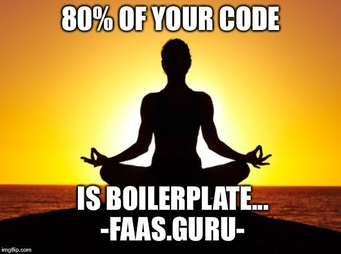

# faasguru
Software, tips and labs about FaaS and Serverless technology

**Cleuton Sampaio** 

- **API Gateway + AWS Lambda + Go**:
    - [**PORTUGUÊS** Expondo uma função Go com AWS Lambda e AWS API Gateway](./portuguese/awsapigateway) 
    - [**ENGLISH** Deploying a Go API with AWS Lambda and API Gateway](./english/awsapigateway)

- **AWS Lambda using Go**:
    - [**PORTUGUÊS** Criando verificação de assinatura em **Go**](./portuguese/awsgo) 
    - [**ENGLISH** Create signature verifier using **Go**](./english/awsgo)

- **Open FaaS - Create Java functions**:
    - [**PORTUGUÊS** Crie uma função **Java**](./portuguese/openfaas-java) 
    - [**ENGLISH** Create a **Java** function](./english/openfaas-java)

- **Open FaaS**:
    - [**PORTUGUÊS** Seu próprio ambiente **FaaS**](./portuguese/openfaas1) 
    - [**ENGLISH** Your own **Faas** platform](./english/openfaas1)

- **Lambda vs gRPS vs Choreography vs HTTP/REST**: 
    - [**PORTUGUÊS** Uma comparação entre **FaaS** com **AWS Lambda** e todos esses outros meios](./portuguese/awsjava) 
    - [**ENGLISH** A comparison between **FaaS** with **AWS Lambda** and all these other options](./english/awsjava)
