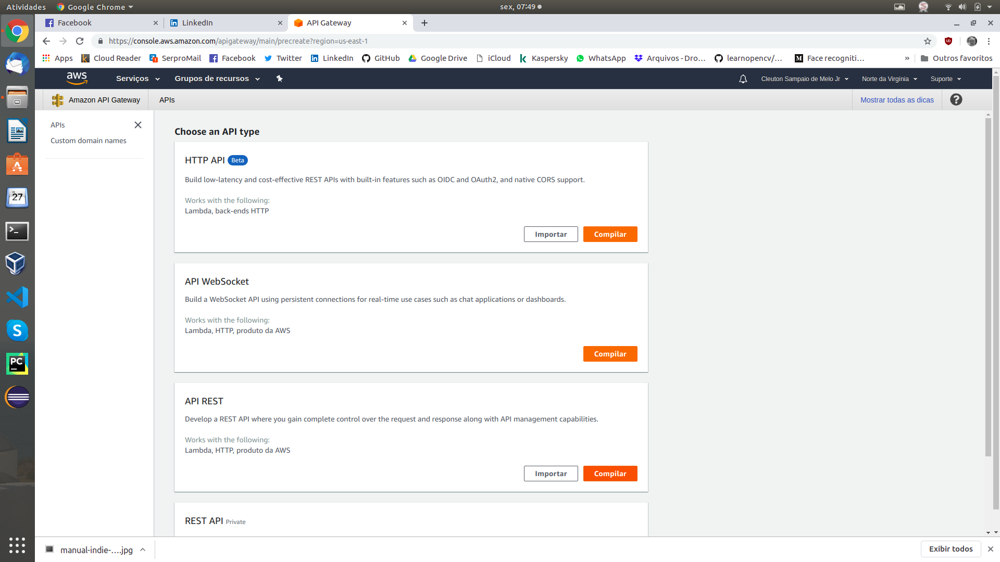
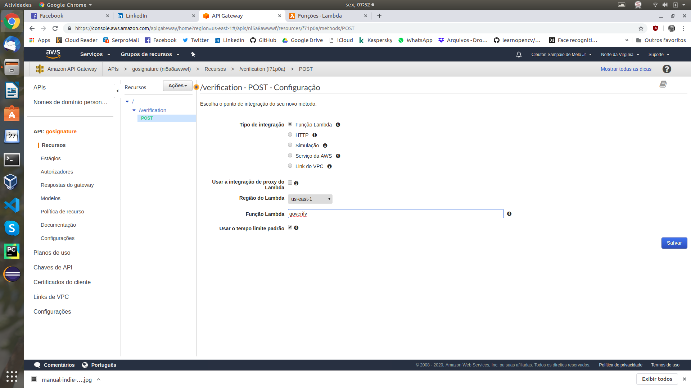
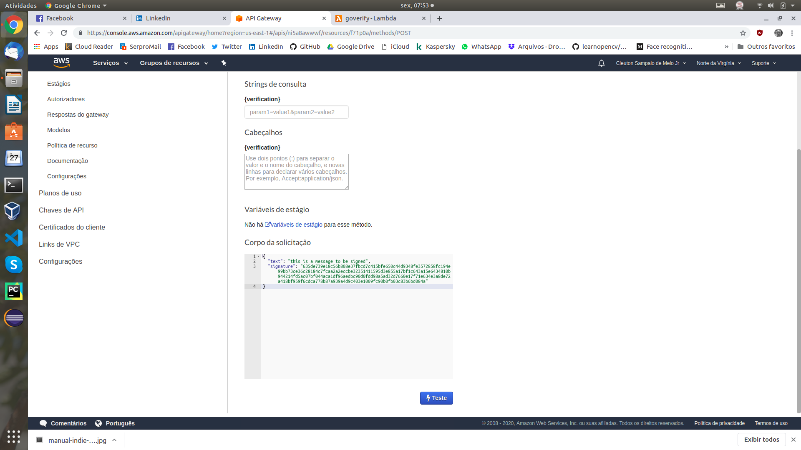

# faasguru
Software, tips and labs about FaaS and Serverless technology

**Cleuton Sampaio** 


# Deploying a Go API with AWS Lambda and API Gateway


Seriously, man! In 15 minutes I deployed that [**Go signature verification function**](http://faas.guru/english/awsgo/) and exported it as an API using the AWS services: Lambda and API Gateway. Nothing can be simpler! (I did it while listening to **Iron Maiden**, **Pantera** and **Motorhead**).

This is what **FaaS** means!

For this to work, I assume that you have created that **Go** function on AWS Lambda: [**this article**](http://faas.guru/english/awsgo/). I recommend you to read it again!

## Create an API

Visit the [**AWS Management Console**](https://console.aws.amazon.com/console/home?region=us-east-1) and create a new API:


Select api type: REST API:



Set up the lambda function you want to invoke (the same one we created earlier. If you don't know the lambda's name you gave it, see your Lambda functions on the AWS Console):


Set up a **REST resource** and a **HTTP method** for your api, pointing to the Lambda function. This is done by the **actions** button:



Let's use **POST** because our **payload** is big!

Done! Your api is ready and configured to invoke its Lambda function using a POST method:


## Testing the API

We can test your new API directly from here. In the previous figure, you saw a **Test** link as you click it. Then enter the same **JSON** you used to test Lambda in the previous article. Paste it in **request body** field:



Click the **Test** button and you will see the result:


In the **response body** you that **true** word, indicating that the signature is valid. Done!

## Exposing Your API to the World

You didn't create an API just to be invoked within AWS, right? You want to invoke it from outside! Ok, we need to create a **stage** for this. I created a stage called **Beta**:


Now you need to **deploy** your API. Click the **actions** button and select this option:


## Invoking Your API with cURL

You can now consume your api in many ways. I will show one that is crude but demonstrates well: cURL! First, we need the URL of your **stage**. Go to the stage and drill down until you get to the HTTP method:


Copy this URL as we will mount the command with it.

The command is simple! Let's copy that **JSON** we used to test the API and build a cURL command:

```
curl --header "Content-Type: application/json" \
  --request POST \
  --data '{"text":"this is a message to be signed","signature":"635de739e18c56b808e37fbcd7c415bfe650c44d9348fe3572858fc194e99bb73ce36c28184c7fcaa2a2eccbe32351411595d3e855a17bf1c643a15e6434810b944214fd5ac07bf044aca1df96aedbc90d0fdd98a5ad32d7660e17f71e634e3a8de72a418bf959f6cdca778b87a939a4d9c403e1009fc90b0fb03c83b6bd084a"}' \
  https://ni5a8awwwf.execute-api.us-east-1.amazonaws.com/beta/verification
```

Now, see the result:  


That **true** with highlight is the result of invoking our Lambda Go function!

Well, I did what I promised! I created and exposed a Go API in a few minutes! Of course, but some things are still missing, such as billing and access control, which you can create with the **API keys**. Without it, your API will be open to the world and you will pay the bill! You need to limit access per user. But that is the subject of another article! The basics are there!


