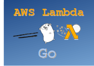
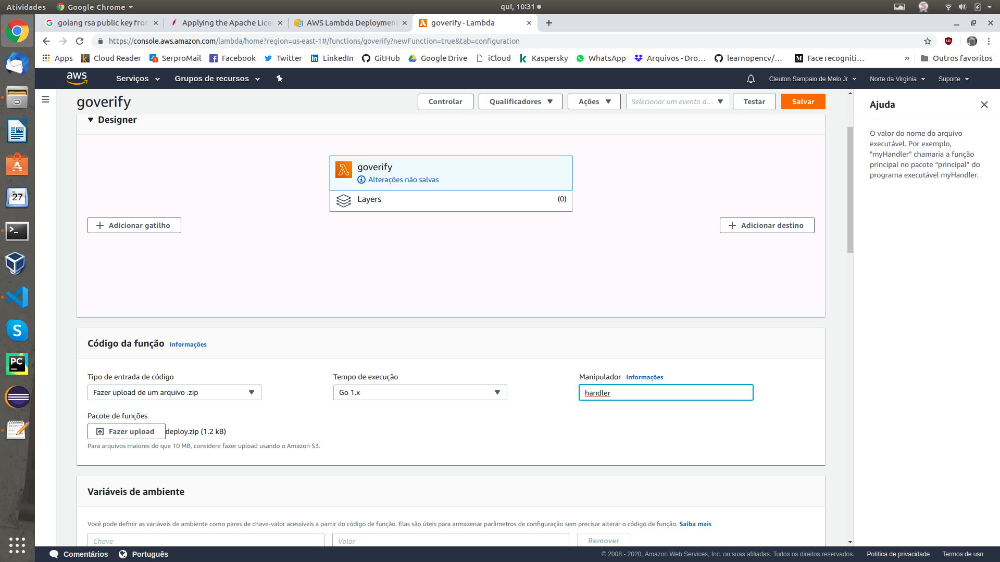

# faasguru
Software, tips and labs about FaaS and Serverless technology

**Cleuton Sampaio** 


# Create a signature verifier using Go



Verifying the digital signature of a message, token, or file is very important in modern times, and is a good example of a **FaaS** implementation. If you had to do it the traditional way, you would have to worry about the code required to make your service available, which would be of immense accidental complexity.

I have already shown a [**Java sample**](http://faas.guru/english/awsjava/) and now I will show you how to do the same thing using the **Go** language. You'll find it even simpler to create a simple and robust solution for your transaction security needs.

## Creating Keys

This function will receive a message, consisting of the text and its digital signature, using a **public key** to validate the signature. The signature of a message is its hashcode encrypted with the message author's private key. Only your public key can decrypt the hashcode and verify that it is valid.

I will use [**openssl**](https://www.openssl.org/) to generate a **RSA** key pair:

```
openssl genrsa -out private.pem 1024
openssl rsa -in private.pem -pubout > public.pem
```
I now have two files: One containing the private key (private.pem) and one containing the public key (public.pem). Here is the public key file, in PEM format:
```
-----BEGIN PUBLIC KEY-----
MIGfMA0GCSqGSIb3DQEBAQUAA4GNADCBiQKBgQDh+RAlt20tUb4YI0lBWlQ1+rvQ
YBrizD/AQ7qUQWqd1cbEiQACC0OTDNAIMLDr5us7xxBuQJwpK/9TX/oMelT4vqo6
gkci9dv/6op/ba9d0w3ikMHKJkXJrH9qBPagsQyz/v6Eba+Vr7nwJdza8R4nSwmM
4HvyHxaYXro+5Gg3IQIDAQAB
-----END PUBLIC KEY-----
```

Now I'll create a sample message and sign it: 

```
cat > message.txt
this is a message to be signed<CTRL+D>
```
After pressing CTRL+D, the text will be saved without linefeed. Then I can sign it: 

```
openssl dgst -sha1 -sign private.pem -hex -out sha1.sign message.txt
```
The **hex** option creates an hexadecimal string signature file. Other option is to use base64 encoding. This is the signature file's content: 

```
RSA-SHA1(message.txt)= 635de739e18c56b808e37fbcd7c415bfe650c44d9348fe3572858fc194e99bb73ce36c28184c7fcaa2a2eccbe32351411595d3e855a17bf1c643a15e6434810b944214fd5ac07bf044aca1df96aedbc90d0fdd98a5ad32d7660e17f71e634e3a8de72a418bf959f6cdca778b87a939a4d9c403e1009fc90b0fb03c83b6bd084a
```
I'll use only the hexadecimal string after the equal ("=") sign. 

## The Go Code

Before start coding, a dependency is necessary: [**AWS Go Lambda API**](https://docs.aws.amazon.com/lambda/latest/dg/go-programming-model-handler-types.html): 

```
go get github.com/aws/aws-lambda-go/lambda
```

The [**code**](https://github.com/cleuton/faasguru/blob/master/awsgo/handler.go) implements a signature verification function and an **AWS handler**. I used the **crypto** and **encoding** packages to read the public key and verify the signature. First, I need to load the **public.pem** file and extract the public key. This is done in the **loadKey()** function:

```
func loadKey(filepath string) (*rsa.PublicKey,error) {
	pub, err := ioutil.ReadFile(filepath)
	if err != nil {
		return nil, fmt.Errorf("Cannot open pem file")
	}
	pubPem, _ := pem.Decode(pub)
	parsedKey, err := x509.ParsePKIXPublicKey(pubPem.Bytes) 
	if err != nil {
		return nil, fmt.Errorf("Error parsing key")
	}

	var pubKey *rsa.PublicKey
	pubKey, ok := parsedKey.(*rsa.PublicKey)
	if !ok {
		return nil, fmt.Errorf("Cannot parse public key")
	}
	return pubKey,nil
}
```
I get the name of the pem file, and read it with **ioutil**. Then I decode it into a binary key, using the packages  **encoding/pem** and **crypto/x509**.

The function that receives a request from **AWS Lambda** is **handleRequest()**:

```
func HandleRequest(ctx context.Context, msg VerifyMessage) (bool, error) {
	key, err1 := loadKey("./public.pem")
	if err1 != nil {
		log.Fatal("Error loading public key")
	}
	return verify(key, msg.Sig, msg.Text)
}
```

In this function I receive the **context** and an instance of a **struct** I created based on JSON: 

```
type VerifyMessage struct {
		Text string `json:"text"`
		Sig  string `json:"signature"`
}
```
It will be formatted from a **JSON** request with the properties **text** and **signature**. After loading the public key, I verify the signature using the received JSON properties. This is done by the **verify()** function:

```
func verify(pubkey *rsa.PublicKey, sig string, message string) (bool,error) {
	msg := []byte(message)
	signature, err1 := hex.DecodeString(sig)
	if err1 != nil {
		return false, fmt.Errorf("Error decoding signature")
	}
	returnValue := true
	hashed := sha1.Sum(msg)

	err := rsa.VerifyPKCS1v15(pubkey, crypto.SHA1, hashed[:], signature)
	if err != nil {
		returnValue = false
	}
	return returnValue, nil
}
```
I need to decode the signature string, making it a binary value again, which is done with the **hex.Decode()** method. Then I use the **rsa.VerifyPKCS1v15()** method by passing the pointer to the public key, the **hash algorithm type** (in this case: SHA1), the hash vector I calculated from the message's text, and the signature digital. If there is no error, the signature is valid.

To instantiate this on AWS Lambda, I just need one more thing in the **main()** function:

```
lambda.Start(HandleRequest)
```

Once this code is executed, the **handleRequest()** function will be available to be invoked, which can be done in a number of ways, including: HTTP, Queue, IoT, Database Events. data etc.

## Creating the Function in AWS Lambda

*(My AWS console is in Portuguese, but the fields are very similar)*

The first step is to log in to your amazon account and call the **AWS Console**. We already saw this when I showed the Java version.

Then we need to create another lambda function, this time using the runtime **Go**:


Now we need to create a zip file with our compiled **Go** code (and its dependencies) in addition to the **public.pem** file. Just compile our code:

```
GOOS=linux go build handler.go
```

Then we zipped the binary and "public.pem" to send to AWS.

## Uploading code to AWS lambda

In the following screen we can upload a ZIP file:



Do not forget to enter the name of the **Go** program which is "handler".

When saving, the file will be sent to AWS. To test, we need to create a test event:


Here it is important to create a **JSON** exactly as our **handleRequest()** function expects!

## Invoking the function

We can use the AWS console itself to invoke our function by simply clicking the **TEST** button:


We can see that it returned **true**.

In the next article, I will show you how to expose this function via REST using **AWS API Gateway**.
