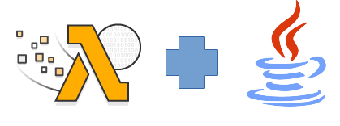
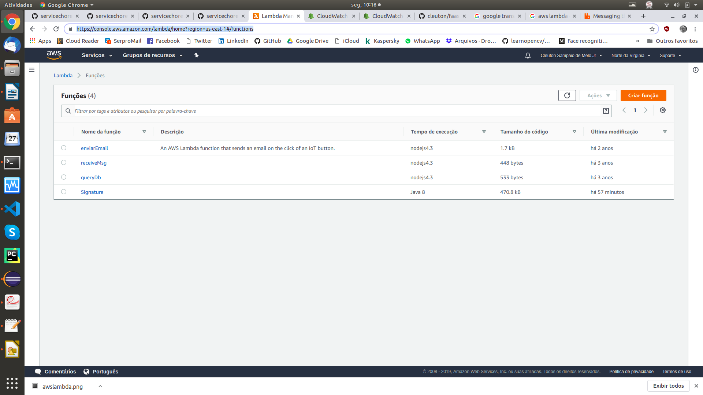
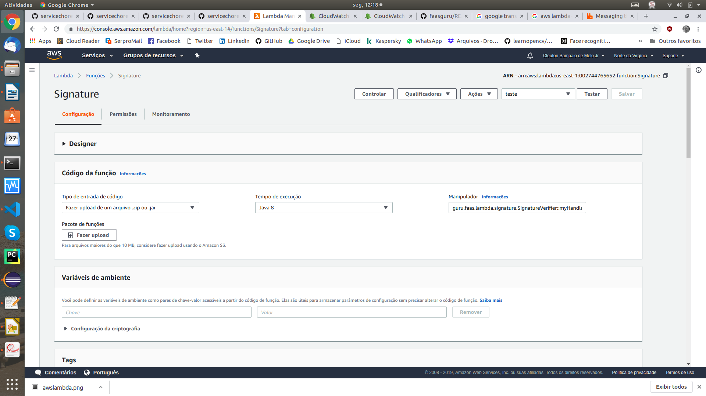
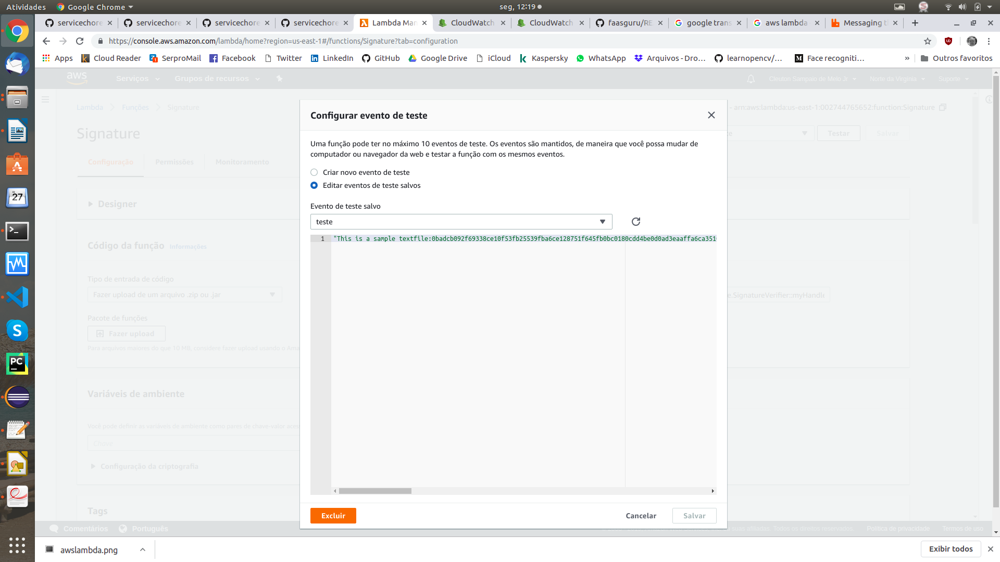
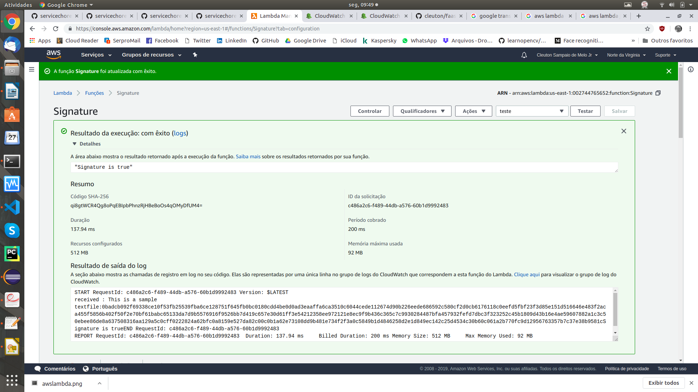

# faasguru
Software, tips and labs about FaaS and Serverless technology

**Cleuton Sampaio** 




# Lambda vs gRPS vs Choreography vs HTTP / REST

I always say that 80% of your code is boilerplate. Ok, it may be overkill (and it certainly is), but part of your source code, where you have invested a lot of time and effort is related to infrastructure, not functionality. What do I mean by * infrastructure *? All that is required for your code to provide the desired service. And usually this * infrastructure * code is boilerplate, ie copy and paste with some changes, for example:

- Protocols handling;
- Input formatting;
- Output formatting;

## Boilerplate but not harmless!

Despite being *boilerplate* this code is not simple and not harmless! Big problems can arise if you inadvertently make a mistake or change something. Therefore, you need to know what you are doing and to know all the technologies involved in order to avoid problems.

I estimate a developer will waist between 50% and 80% of his time and effort (and cost) concerned with infrastructure code, including study, proof of concept, and so on.

To demonstrate what I am saying, and show an alternative, I decided to post this article.

## Signature

This is a very simple example of application. A *Pojo* **Java** that verifies the digital signature of a text. I have already created many versions of this small component, and I will compare them here.

It's a very simple code indeed. Let's look at the [**main file**](https://github.com/cleuton/faasguru/tree/master/awsjava/src/main/java/guru/faas/lambda/signature/SignatureVerifier.java):

```
    public String myHandler(String textAndSignature, Context context) throws InvalidKeyException, KeyStoreException, NoSuchAlgorithmException, CertificateException, NoSuchProviderException, SignatureException, IOException, DecoderException {
    	// Comment following two lines to run locally:
        LambdaLogger logger = context.getLogger();
        logger.log("received : " + textAndSignature);
        String [] parameters = textAndSignature.split(":");
        String returnValue = "";
		returnValue =  "Signature is " + verify(parameters[1],parameters[0],"*","meucertificado","teste001");
		// Comment following line to run locally:
		logger.log(returnValue);
        return returnValue;
    }
    
	public static boolean verify(String hexSignature, String texto,
			String keystorePath, String alias, String keystorePassword) 
					throws KeyStoreException, NoSuchAlgorithmException, 
							CertificateException, IOException, InvalidKeyException, 
							NoSuchProviderException, DecoderException, SignatureException {
		boolean resultado = false;
		InputStream keystoreLocation = null;
		if (!keystorePath.equals("*")) {
			FileInputStream fisKs = new FileInputStream(keystorePath);
			keystoreLocation = fisKs;
		}
		else {
			InputStream isKs = SignatureVerifier.class.getClassLoader().getResourceAsStream("minhakeystore.jks");
			keystoreLocation = isKs;
		}
	    KeyStore keystore = KeyStore.getInstance(KeyStore.getDefaultType());
	    keystore.load(keystoreLocation, keystorePassword.toCharArray());
	    java.security.cert.Certificate certificate = keystore.getCertificate(alias);
	    PublicKey pubKey = certificate.getPublicKey();
		Signature sig = Signature.getInstance("MD5withRSA", "SunRsaSign"); 
		sig.initVerify(pubKey);
		Hex hex = new Hex();
		byte [] textContent = texto.getBytes("UTF-8");
	    sig.update(textContent);
		byte [] signature = (byte[]) hex.decode(hexSignature);
	    
		resultado = sig.verify(signature);
		
		return resultado;
	}
```

Total: **66 lines**!

The **verify()** method takes two strings: a text and a digital signature from it, and verifies the signature using a **keystore** that I included in the project.

Nothing could be simpler, could it? This is actually the code to make this small module available as a function [**Lambda in AWS!**] (https://docs.aws.amazon.com/lambda/latest/dg/get-started-step4- optional.html). Note that there is virtually no **boilerplate** code here.

This is a perfect example of **FaaS**!

Now let's look at other options of exposing the same code, and comparing everything.

## RESTful Service

In this [**repository**](https://github.com/cleuton/servicechoreography/tree/master/javaApp/signature) we have a RESTful version of this same service. Here, I used [**Dropwizard**](https://www.dropwizard.io/en/stable/) to create a Java **JAX-RS** application. Let's look at the numbers of this version:

- 6 essential source files;
- 248 lines of code;

You can download the repository and test. There is even a python client for this.

The essential code to verify the signature has 66 lines, this version has 248 lines! In other words, the essential code is about 26% of the lines of code in this option. This is because I greatly simplified the RESTful service!

## gRPC

In this release, I created a [**gRPC  based service**](https://grpc.io/) and needed to create a load balancing engine using [**Apache Zookeeper**](https://zookeeper.apache.org/), but I will not consider this when count the lines of code, but I will have to consider the client lines of code, after all, it's part of the infrastructure. Although it is necessary, it is not essential. You can see this version [**in this folder**](https://github.com/cleuton/servicechoreography/tree/master/javaApp/grpcserverjava/src/main/java/com/obomprogramador/grpc). Here are the numbers:

- **Server**:
    - 426 lines of code!

Comparing to the 66 lines of essential code, we see that the ratio has expanded a lot: only 15% represents the essential code. I didn't even count the customer lines!

## Service choreograpy

I implemented an example using service choreography, with asynchronous messaging and [**RabbitMQ**](https://www.rabbitmq.com/). I created a [**worker**](https://github.com/cleuton/servicechoreography/tree/master/javaApp/choreography) and a client, but I will only count worker lines:

- 151 lines;

Here the relationship has improved a lot. The essential code is 43% of the total code.

## How to Make a Lambda Available in Java

Compile the [**source code**](https://github.com/cleuton/faasguru/tree/master/awsjava/src/main/java/guru/faas/lambda/signature) with the command:

```
mvn clean package shade: shade
```

This will produce an *Uber jar* that you can load into the AWS console. [**Go to console**](https://console.aws.amazon.com/lambda/home?region=us-east-1#/functions) and go to lambda functionality:



Select **Create Role** and indicate which is **Runtime**. Then upload your **jar**:



Finally, set up a test event:



You can perform your function and evaluate the results:



The [**example project**](https://github.com/cleuton/faasguru/tree/master/awsjava/src/main/java/guru/faas/lambda/signature) has everything needed to create a **uber jar** for AWS Lambda. And you can use another product, such as [**API Gateway**](https://aws.amazon.com/api-gateway/) to expose your role to the world.


## Conclusion

Less code, less complexity! You can expose functions in less than 1 minute! That is the beauty of **FaaS**.
