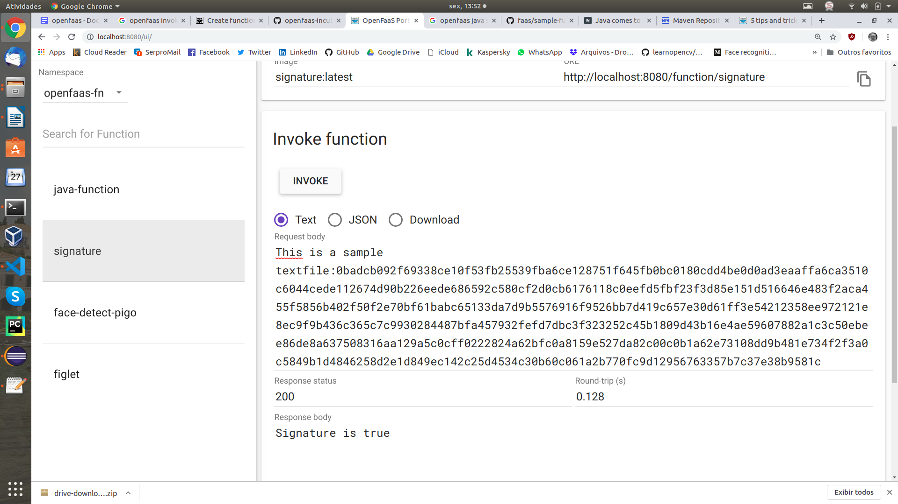

# faasguru
Software, tips and labs about FaaS and Serverless technology

**Cleuton Sampaio** 


# Create a Java Function

Let's create a Java function and serve it with **Open FaaS**, fully **Serverless**. This function is the one I used in the first article when I installed it on **AWS Lambda**. It gives the digital signature of a text.

[**source code**](https://github.com/cleuton/faasguru/blob/master/openfaas-java/src/main/java/com/openfaas/function/Handler.java) demonstrates how simple it is to create a function for the Open FaaS environment. :

```
import com.openfaas.model.IHandler;
import com.openfaas.model.IResponse;
import com.openfaas.model.IRequest;
import com.openfaas.model.Response;
...

public class Handler implements com.openfaas.model.IHandler {

    public IResponse Handle(IRequest req) {
        Response res = new Response();
        String [] parameters = req.getBody().split(":");
        System.out.println("Parameters: " + req.getBody());
        String returnValue = "";
        try {
            returnValue =  "Signature is " + verify(parameters[1],parameters[0],"*","meucertificado","teste001");
            System.out.println("Return: " + returnValue);
            res.setBody(returnValue);
        } catch (Exception ex) {
            res.setBody("Exception :" + ex.getMessage());
        }
	    return res;
    }
...
```

As you can see, the function gets an instance of [**IRequest**](https://github.com/openfaas/templates/blob/master/template/java8/model/src/main/java/com/openfaas/model/IRequest.java) and returns an instance of [**IResponse**](https://github.com/openfaas/templates/blob/master/template/java8/model/src/main/java/com/openfaas/model/IResponse.java). It should implement the interface [**com.openfaas.model.IHandler**](https://github.com/openfaas/templates/blob/master/template/java8/model/src/main/java/com/openfaas/model/IHandler.java) which only has the method **handle()**.

It really is very simple!

I just **inserted** the Signature.Java code into it and that's it!

## How to create the function

First, you must create a function by downloading the Java template (can be 8 or 12):

```
faas-cli new --lang java8 signature
```

Then you "insert" your class or method. That's what I did. When ready, copy the files [**build.gradle**](../../openfaas-java/build.gradle) and [**settings.gradle**](../../openfaas-java/settings.gradle) over the ones it generated. Why? Well, first, I'm using two **Maven** libraries and I need to make some modifications to build.gradle:

```
repositories{
    mavenCentral()
}

dependencies {
    ...    
    implementation 'commons-codec:commons-codec:1.13'
    compile group: 'commons-io', name: 'commons-io', version: '2.6'
```

This is to download the commons-codec and commons-io that I am using.

Then you need to change the function name in "rootProject.name" within settings.gradle.

**Note:** The OpenFaaS team's decision to use **Gradle** is unfortunate. They are trying to **push** a tool when the default for Java is **Maven**. Really unfortunate.

Ok, now is the time to build:

```
sudo faas-cli build -f signature.yml
```

If everything is ok, deploy it: 

```
faas-cli deploy -f signature.yml
```

And you can execute the function via Console or invoke using the function URL:



Or you can post a request with **CURL**: 

```
curl -d "This is a sample textfile:0badcb092f69338ce10f53fb25539fba6ce128751f645fb0bc0180cdd4be0d0ad3eaaffa6ca3510c6044cede112674d90b226eede686592c580cf2d0cb6176118c0eefd5fbf23f3d85e151d516646e483f2aca455f5856b402f50f2e70bf61babc65133da7d9b5576916f9526bb7d419c657e30d61ff3e54212358ee972121e8ec9f9b436c365c7c9930284487bfa457932fefd7dbc3f323252c45b1809d43b16e4ae59607882a1c3c50ebee86de8a637508316aa129a5c0cff0222824a62bfc0a8159e527da82c00c0b1a62e73108dd9b481e734f2f3a0c5849b1d4846258d2e1d849ec142c25d4534c30b60c061a2b770fc9d12956763357b7c37e38b9581c" -X POST http://localhost:8080/function/signature
```

This hex text is the signature of the phrase "This is a sample textfile".

If you want to use another format, like **JSON**, it's very simple.

Anything you type in **stdout** will be logged by Open FaaS and you can log it with the command:

```
faas-cli logs signature
...
2019-12-13T16:49:09Z 2019/12/13 16:49:09 Metrics listening on port: 8081
2019-12-13T16:49:16Z 2019/12/13 16:49:16 stdout: Parameters: This is a sample textfile:0badcb092f69338ce10f53fb25539fba6ce128751f645fb0bc0180cdd4be0d0ad3eaaffa6ca3510c6044cede112674d90b226eede686592c580cf2d0cb6176118c0eefd5fbf23f3d85e151d516646e483f2aca455f5856b402f50f2e70bf61babc65133da7d9b5576916f9526bb7d419c657e30d61ff3e54212358ee972121e8ec9f9b436c365c7c9930284487bfa457932fefd7dbc3f323252c45b1809d43b16e4ae59607882a1c3c50ebee86de8a637508316aa129a5c0cff0222824a62bfc0a8159e527da82c00c0b1a62e73108dd9b481e734f2f3a0c5849b1d4846258d2e1d849ec142c25d4534c30b60c061a2b770fc9d12956763357b7c37e38b9581c
2019-12-13T16:49:16Z 2019/12/13 16:49:16 stdout: InputStream: sun.net.www.protocol.jar.JarURLConnection$JarURLInputStream@44f88448
2019-12-13T16:49:16Z 2019/12/13 16:49:16 stdout: Return: Signature is true
2019-12-13T16:49:16Z 2019/12/13 16:49:16 POST / - 200 OK - ContentLength: 17
2019-12-13T16:49:16Z 2019/12/13 16:49:16 stdout: Request / 17 bytes written.
```


