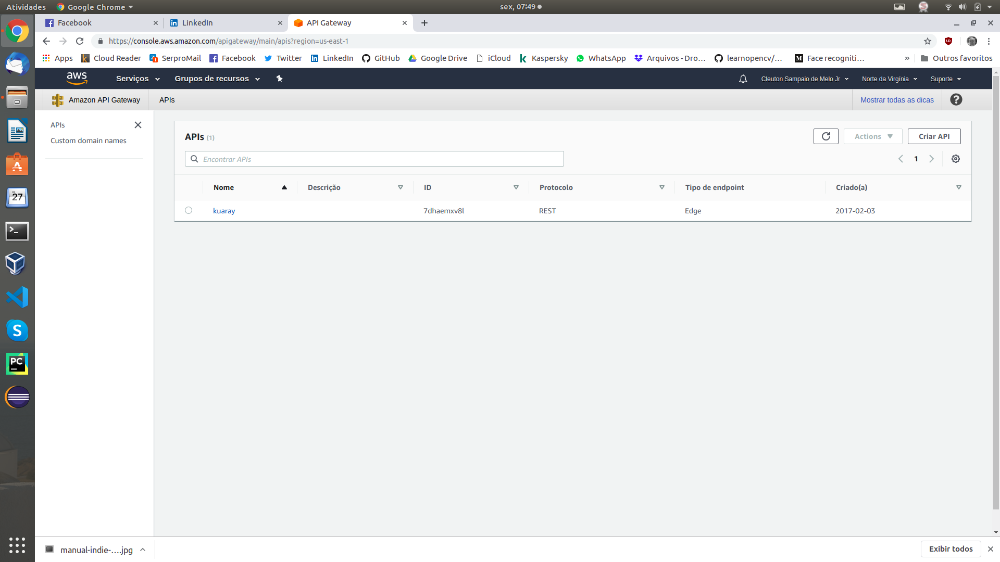

# faasguru
Software, tips and labs about FaaS and Serverless technology

**Cleuton Sampaio** 


# Expondo uma função Go com AWS Lambda e AWS API Gateway


Fala sério, cara! Em 15 minutos eu implantei aquela [função de verificação de assinatura em Go](https://github.com/cleuton/faasguru/tree/master/awsgo) e a exportei como uma API usando os serviços do AWS: Lambda e API Gateway. Nada pode ser mais simples! (e tudo isso escutando **Iron Maiden**, **Pantera** e **Motorhead**). 

É isso que significa **FaaS**!

Para que isto funcione, você tem que ter criado a função **Go** no AWS Lambda, como eu ensinei anteriormente. Veja novamente o [**artigo**](http://faas.guru/portuguese/awsgo/), caso tenha dúvidas. 

## Crie uma API

Acesse a [**console de gerenciamento do AWS**](https://console.aws.amazon.com/console/home?region=us-east-1) e crie uma nova API: 



Selecione o tipo de api: API REST: 


Configure a função lambda que deseja invocar (a mesma que criamos anteriormente. Se não souber o nome que deu a ela, consulte as suas funções Lambda, na AWS Console): 


Configure um **recurso REST** e um **método HTTP** para sua api, apontando para a função Lambda. Isto é feito pelo botão de **ações**: 


Vamos usar **POST** pois nosso **payload** é grande!

Pronto! Sua api está pronta e configurada para invocar sua função Lambda utilizando um método POST: 


## Testando a API

Podemos testar a sua nova API diretamente daqui. Na figura anterior, você viu um link **Testar**, pois clique nele. Depois, informe o mesmo **JSON** que você usou para testar a Lambda, no artigo anterior. Cole no **corpo da solicitação**: 


Clique no botão **Testar** e você verá o resultado: 


No **corpo da resposta** você vê **true** indicando que a assinatura é válida. Pronto!

## Expondo sua API ao Mundo

Você não criou uma API só para ser invocada dentro da AWS, certo? Você quer invocar de fora! Ok, precisamos criar um **estágio** para isso. Eu criei um estágio chamado **Beta**: 


Agora, você precisa **implantar** sua API. Clique no botão de **ações** e selecione esta opção: 


## Acessando sua API com cURL

Agora você pode consumir sua api de várias maneiras. Vou mostrar uma que é tosca mas que demonstra bem: cURL! Primeiro, precisamos da URL do seu **estágio**. Acesse o estágio e faça **drill-down** até chegar ao método HTTP: 


Copie essa URL, pois vamos montar o comando com ela. 

O comando é simples! Vamos copiar aquele **JSON** que usamos para testar a API e montar um comando cURL: 

```
curl --header "Content-Type: application/json" \
  --request POST \
  --data '{"text":"this is a message to be signed","signature":"635de739e18c56b808e37fbcd7c415bfe650c44d9348fe3572858fc194e99bb73ce36c28184c7fcaa2a2eccbe32351411595d3e855a17bf1c643a15e6434810b944214fd5ac07bf044aca1df96aedbc90d0fdd98a5ad32d7660e17f71e634e3a8de72a418bf959f6cdca778b87a939a4d9c403e1009fc90b0fb03c83b6bd084a"}' \
  https://ni5a8awwwf.execute-api.us-east-1.amazonaws.com/beta/verification
```

Agora, veja só o teste: 


Aquele **true** com highlight é o resultado da invocação da nossa função Lambda em Go!

Bom, cumpri o que prometi! Criei e expus uma API Go em poucos minutos! É claro que ainda faltam algumas coisas, como contabilização e controle de acesso, coisa que você pode criar com as **chaves de API**. Sem isso, sua API estará aberta ao mundo e você é quem pagará a conta! Você precisa limitar o acesso por usuário e estabelecer uma bilhetagem. Mas isso é assunto para outro artigo! O básico está ai!

