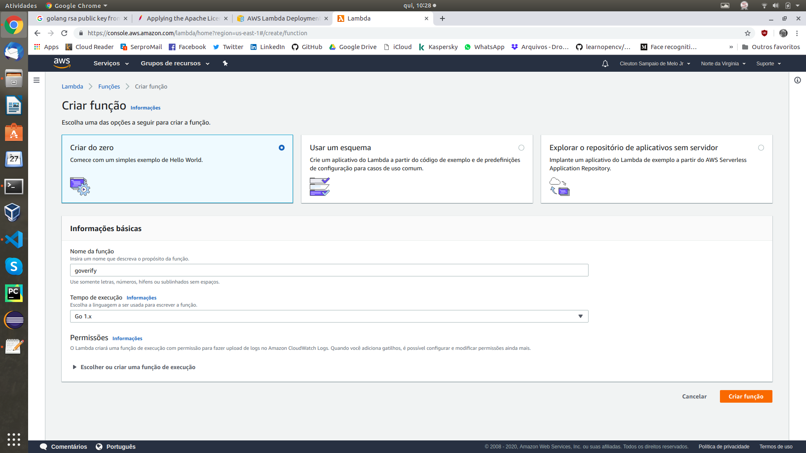

# faasguru
Software, tips and labs about FaaS and Serverless technology

**Cleuton Sampaio** 


# Criando verificação de assinatura em Go


Verificar a assinatura digital de uma mensagem, de um token ou de um arquivo, é algo muito importante nos dias modernos, além de ser um excelente exemplo de implementação **FaaS**. Se você tivesse que fazer isso da forma tradicional, teria que se preocupar com o código necessário para disponibilizar seu serviço, que seria de imensa complexidade acidental.

Eu já mostrei uma [**implementação em Java**](http://faas.guru/portuguese/awsjava/) e agora mostrarei como fazer algo semelhante utilizando a linguagem **Go**. Você verá como é ainda mais simples criar uma solução simples e robusta para suas necessidades de segurança de transações.

## Criação das chaves

Esta função receberá uma mensagem, composta pelo texto e sua assinatura digital, utilizando uma **chave pública** para validar a assinatura. A assinatura de uma mensagem é o seu **hashcode** encriptado com a **chave privada** do autor da mensagem. Somente a sua chave pública pode decripitar o hashcode e verificar se é válido.

Vou usar o [**openssl**](https://www.openssl.org/) para gerar um par de chaves **RSA**: 

```
openssl genrsa -out private.pem 1024
openssl rsa -in private.pem -pubout > public.pem
```
Agora tenho dois arquivos: Um contendo a chave privada (private.pem) e outro contendo a chave pública (public.pem). Eis o arquivo da chave pública, em formado PEM: 

```
-----BEGIN PUBLIC KEY-----
MIGfMA0GCSqGSIb3DQEBAQUAA4GNADCBiQKBgQDh+RAlt20tUb4YI0lBWlQ1+rvQ
YBrizD/AQ7qUQWqd1cbEiQACC0OTDNAIMLDr5us7xxBuQJwpK/9TX/oMelT4vqo6
gkci9dv/6op/ba9d0w3ikMHKJkXJrH9qBPagsQyz/v6Eba+Vr7nwJdza8R4nSwmM
4HvyHxaYXro+5Gg3IQIDAQAB
-----END PUBLIC KEY-----
```

Bom, vou criar um arquivo e gerar uma assinatura digital: 

```
cat > message.txt
this is a message to be signed<CTRL+D>
```
Após teclar CTRL+D o texto será salvo sem LineFeed. Então, posso gerar uma assinatura digital com o comando: 

```
openssl dgst -sha1 -sign private.pem -hex -out sha1.sign message.txt
```
A opção **hex** gera a assinatura em formato codificado como hexadecimal string. Outra opção é usar base64. Eis o conteúdo do arquivo de assinatura digital: 

```
RSA-SHA1(message.txt)= 635de739e18c56b808e37fbcd7c415bfe650c44d9348fe3572858fc194e99bb73ce36c28184c7fcaa2a2eccbe32351411595d3e855a17bf1c643a15e6434810b944214fd5ac07bf044aca1df96aedbc90d0fdd98a5ad32d7660e17f71e634e3a8de72a418bf959f6cdca778b87a939a4d9c403e1009fc90b0fb03c83b6bd084a
```
Para nós, interessa apenas o que vem depois do sinal de igual ("=") que é a assinatura em si. 

## O Código Go

Antes de mais nada, é preciso instalar uma dependência: [**AWS Lambda API para Go**](https://docs.aws.amazon.com/lambda/latest/dg/go-programming-model-handler-types.html): 

```
go get github.com/aws/aws-lambda-go/lambda
```

O [**código**](https://github.com/cleuton/faasguru/blob/master/awsgo/handler.go) implementa uma função de verificação de assinatura e um **handler** AWS. Eu usei os pacotes **crypto** e **encoding** para ler a chave pública e verificar a assinatura. Primeiramente, preciso carregar o arquivo **public.pem** e extrair a chave pública. Isso é feito na função **loadKey()**: 

```
func loadKey(filepath string) (*rsa.PublicKey,error) {
	pub, err := ioutil.ReadFile(filepath)
	if err != nil {
		return nil, fmt.Errorf("Cannot open pem file")
	}
	pubPem, _ := pem.Decode(pub)
	parsedKey, err := x509.ParsePKIXPublicKey(pubPem.Bytes) 
	if err != nil {
		return nil, fmt.Errorf("Error parsing key")
	}

	var pubKey *rsa.PublicKey
	pubKey, ok := parsedKey.(*rsa.PublicKey)
	if !ok {
		return nil, fmt.Errorf("Cannot parse public key")
	}
	return pubKey,nil
}
```
Eu recebo o nome do arquivo, abro com **ioutil** e decodifico em uma chave binária, usando os métodos dos pacotes **encoding/pem** e **crypto/x509**. 

A função que recebe um request do **AWS Lambda** é a **handleRequest()**: 

```
func HandleRequest(ctx context.Context, msg VerifyMessage) (bool, error) {
	key, err1 := loadKey("./public.pem")
	if err1 != nil {
		log.Fatal("Error loading public key")
	}
	return verify(key, msg.Sig, msg.Text)
}
```

Além do contexto eu recebo uma struct que eu criei com os dados da mensagem: 

```
type VerifyMessage struct {
		Text string `json:"text"`
		Sig  string `json:"signature"`
}
```
Será formatada a partir de um arquivo **JSON** com as propriedades **text** e **signature**. Depois de carregar a chave pública, eu verifico a assinatura utilizando as propriedades do JSON recebido. Isso é feito pela função **verify()**: 

```
func verify(pubkey *rsa.PublicKey, sig string, message string) (bool,error) {
	msg := []byte(message)
	signature, err1 := hex.DecodeString(sig)
	if err1 != nil {
		return false, fmt.Errorf("Error decoding signature")
	}
	returnValue := true
	hashed := sha1.Sum(msg)

	err := rsa.VerifyPKCS1v15(pubkey, crypto.SHA1, hashed[:], signature)
	if err != nil {
		returnValue = false
	}
	return returnValue, nil
}
```
Preciso decodificar o string da assinatura, transformando-o em valor binário novamente, o que é feito com o método **hex.Decode()**. Depois, uso o método **rsa.VerifyPKCS1v15()** passando o ponteiro para a chave pública, o tipo de algorítmo de **hash** (neste caso: SHA1), o vetor do hash que eu mesmo calculei e a assinatura digital. Se não der erro, a assinatura é válida. 

Para instanciar isso no AWS Lambda, só preciso de mais uma coisina na função **main()**: 

```
lambda.Start(HandleRequest)
```

A partir do momento em que esse código for executado, a função **handleRequest()** estará disponível para ser invocada, o que pode ser feito de várias maneiras, entre elas: HTTP, Eventos de fila, de IoT, de Banco de dados etc.

## Criando a função no AWS Lambda

O primeiro passo é fazer login na sua conta amazon e chamar a **Console do AWS**. Nós já vimos isso quando eu mostrei a versão Java. 

Depois, precisamos criar uma outra função lambda, desta vez usando o runtime **Go**: 



Agora, precisamos criar um arquivo zip com nosso código **Go** compilado (e suas dependências), além do arquivo **public.pem**. Basta compilar nosso código: 

```
GOOS=linux go build handler.go
```

Depois, zipamos o binário e o "public.pem" para enviar ao AWS.

## Subindo o código para o AWS lambda

Na tela seguinte, podemos subir um arquivo ZIP: 


Não se esqueça de informar o nome do programa **Go** que é "handler".

Ao salvar, o arquivo será enviado ao AWS. Para testar, precisamos criar um evento de teste: 


Aqui é importante criarmos um **JSON** exatamente como nossa função **handleRequest()** espera!

## Invocando a função

Podemos usar a própria console AWS para invocar nossa função, bastando clicar no botão **TESTAR**:


Podemos ver que retornou **true**. 

No próximo artigo, mostrarei a você como expor essa função via REST utilizando o **AWS API Gateway**.

