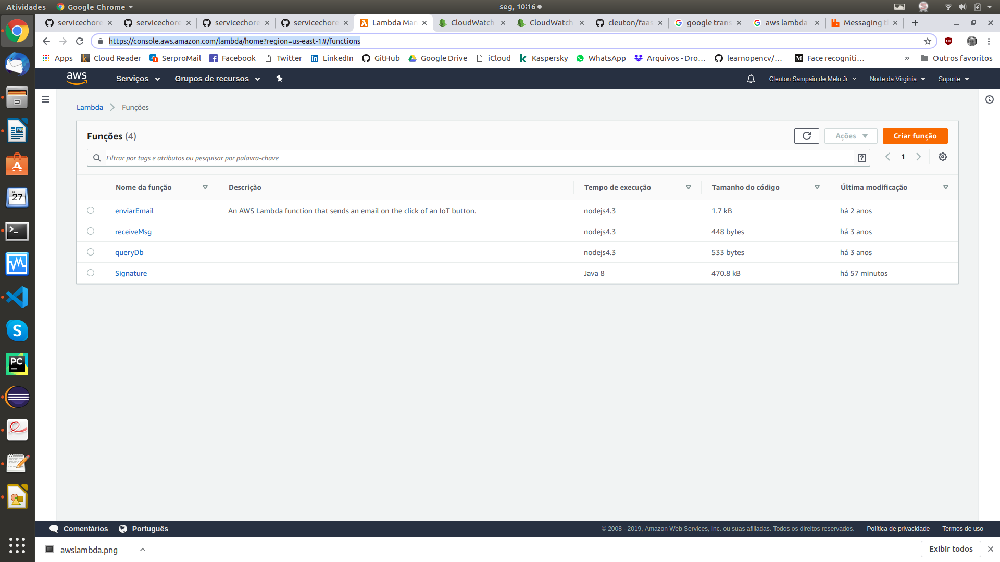

# faasguru
Software, tips and labs about FaaS and Serverless technology

**Cleuton Sampaio** 


# Lambda vs gRPS vs Choreography vs HTTP/REST

Eu sempre digo que 80% do seu código é boilerplate. Ok, pode ser um exagero (e certemente é), porém, parte do seu código-fonte, onde investiu muito tempo e esforço é relacionado à infraestrutura e não à funcionalidade. O que quero dizer com *infraestrutura*? Tudo o que é necessário para que seu código preste o serviço desejado. E geralmente esse código de *infraestrutura* é boilerplate, ou seja, copia e cola com algumas mudanças, por exemplo: 

- Lidar com protocolos;
- Formatar entrada;
- Formatar saída;

## Boilerplate mas não inócuo!

Apesar de ser *boilerplate* este código não é simples e muito menos inócuo! Grandes problemas podem advir se você errar ou alterar inadvertidamente alguma coisa. Portanto, é necessário saber o que está fazendo e conhecer todas as teclonogias envolvidas, de modo a evitar problemas. 

Eu estimo que um desenvolvedor perca entre 50% e 80% do seu tempo e esforço (e custo) preocupado com código de infraestrutura, incluindo estudo, provas de conceito etc. 

Para demonstrar o que estou dizendo, e mostrar uma saída viável, resolvi postar este artigo.

## Signature

Este é um exemplo bem simples de aplicação. Um *Pojo* **Java** que verifica a assinatura digital de um texto. Eu já criei muitas versões deste pequeno componente, e vou compará-las aqui. 

É um código muito simples mesmo. Vejamos o [**arquivo principal**](../../awsjava/src/main/java/guru/faas/lambda/signature/SignatureVerifier.java):

```
    public String myHandler(String textAndSignature, Context context) throws InvalidKeyException, KeyStoreException, NoSuchAlgorithmException, CertificateException, NoSuchProviderException, SignatureException, IOException, DecoderException {
    	// Comment following two lines to run locally:
        LambdaLogger logger = context.getLogger();
        logger.log("received : " + textAndSignature);
        String [] parameters = textAndSignature.split(":");
        String returnValue = "";
		returnValue =  "Signature is " + verify(parameters[1],parameters[0],"*","meucertificado","teste001");
		// Comment following line to run locally:
		logger.log(returnValue);
        return returnValue;
    }
    
	public static boolean verify(String hexSignature, String texto,
			String keystorePath, String alias, String keystorePassword) 
					throws KeyStoreException, NoSuchAlgorithmException, 
							CertificateException, IOException, InvalidKeyException, 
							NoSuchProviderException, DecoderException, SignatureException {
		boolean resultado = false;
		InputStream keystoreLocation = null;
		if (!keystorePath.equals("*")) {
			FileInputStream fisKs = new FileInputStream(keystorePath);
			keystoreLocation = fisKs;
		}
		else {
			InputStream isKs = SignatureVerifier.class.getClassLoader().getResourceAsStream("minhakeystore.jks");
			keystoreLocation = isKs;
		}
	    KeyStore keystore = KeyStore.getInstance(KeyStore.getDefaultType());
	    keystore.load(keystoreLocation, keystorePassword.toCharArray());
	    java.security.cert.Certificate certificate = keystore.getCertificate(alias);
	    PublicKey pubKey = certificate.getPublicKey();
		Signature sig = Signature.getInstance("MD5withRSA", "SunRsaSign"); 
		sig.initVerify(pubKey);
		Hex hex = new Hex();
		byte [] textContent = texto.getBytes("UTF-8");
	    sig.update(textContent);
		byte [] signature = (byte[]) hex.decode(hexSignature);
	    
		resultado = sig.verify(signature);
		
		return resultado;
	}
```

Total: **66 linhas**!

O método **verify()** recebe dois strings: um texto e uma assinatura digital dele, e verifica a assinatura utilizando uma **keystore** que incluí no projeto. 

Nada poderia ser mais simples, não? Na verdade, esse é o código para disponibilizar esse pequeno módulo como uma função [**Lambda no AWS!**](https://docs.aws.amazon.com/lambda/latest/dg/get-started-step4-optional.html). Note que praticamente não existe código **boilerplate** aqui. 

Este é um perfeito exemplo de **FaaS**!

Agora, vejamos outras opções de expor o mesmo código, e comparar tudo.

## RESTful Service

Neste [**repositório**](https://github.com/cleuton/servicechoreography/tree/master/javaApp/signature) temos uma versão RESTful deste mesmo serviço. Aqui, usei [**Dropwizard**](https://www.dropwizard.io/en/stable/) para criar uma aplicação Java **JAX-RS**. Vejamos os números desta versão: 

- 6 arquivos fonte essenciais;
- 248 linhas de código;

Você pode baixar o repositório e testar. Há até um cliente python para isto.

O código essencial para verificar a assinatura tem 66 linhas, esta versão tem 248 linhas! Em outras palavras, o essencial é cerca de 26% das linhas de código desta opção. Isto porque eu simplifiquei muito o serviço REST!

## gRPC

Nesta versão, criei um serviço baseado em [**gRPC**](https://grpc.io/) e precisei criar um mecanismo de balanceamento de carga usando [**Apache Zookeeper**], mas não vou considerar isso ao contar as linhas de código, mas terei que considerar as linhas de código cliente, afinal, faz parte da infraestrutura. Embora seja necessário, não é essencial. Você pode ver esta versão [**nesta pasta**](https://github.com/cleuton/servicechoreography/tree/master/javaApp/grpcserverjava/src/main/java/com/obomprogramador/grpc). Eis os números: 

- **Servidor**:
    - 426 linhas de código!

Comparando com as 66 linhas do código essencial, vemos que a relação ampliou muito: apenas 15% representam o código essencial. Nem contei as linhas do cliente!

## Service choreograpy

Eu implementei um exemplo utilizando coreografia de serviços, com mensagens assíncrinas e [**RabbitMQ**](https://www.rabbitmq.com/). Criei um [**worker**](https://github.com/cleuton/servicechoreography/tree/master/javaApp/choreography) e um client, mas só contarei as linhas do worker: 

- 151 linhas;

Aqui a relação melhorou muito. O código essencial é 43% do código total. 

## Como disponibilizar um Lambda em Java

Compile o [**código fonte**](../../awsjava/src/main/java/guru/faas/lambda/signature/) com o comando: 

```
mvn clean package shade:shade
```

Isso produzirá um *Uber jar* que você poderá carregar na console AWS. [**Acesse a console**](https://console.aws.amazon.com/lambda/home?region=us-east-1#/functions) e vá para a funcionalidade lambda: 



Selecione **Criar função** e indique qual é o **Runtime**. Depois, faça **upload** do seu **jar**: 


Finalmente, configure um evento de teste: 


Você pode executar sua função e avaliar os resultados: 


O [**projeto exemplo**](../../awsjava/src/main/java/guru/faas/lambda/signature/) tem tudo o que é necesário para criar um **uber jar** para o AWS Lambda. E você pode usar outro produto, como o [**API Gateway**](https://aws.amazon.com/pt/api-gateway/) para expor sua função para o mundo.

## Conclusão

Menos código, menor complexidade! Você pode expor funções em menos de 1 minuto! Essa é a beleza do **FaaS**.

