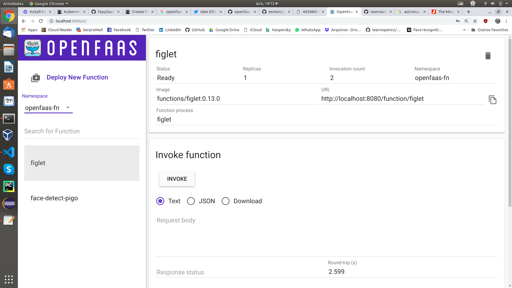
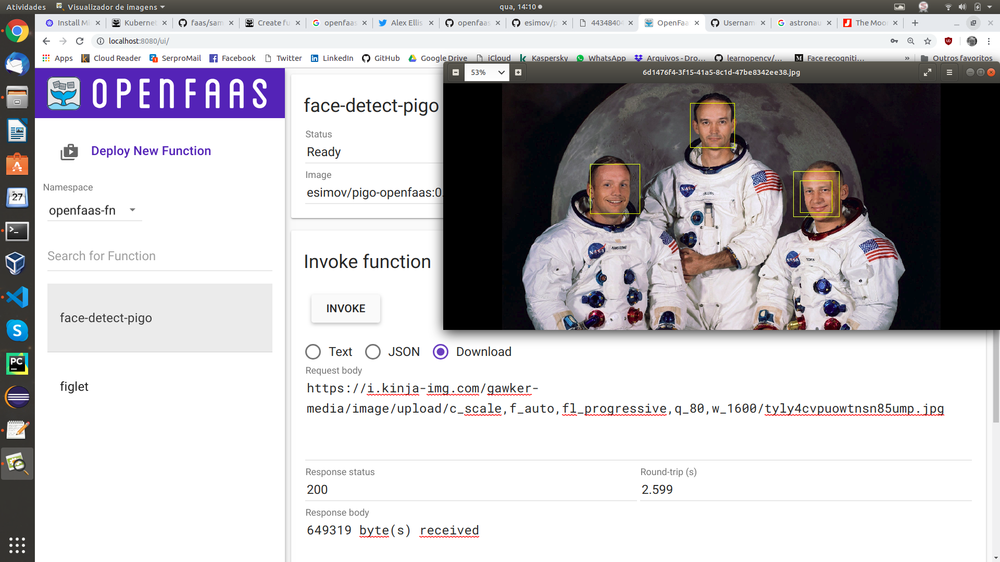

# faasguru
Software, tips and labs about FaaS and Serverless technology

**Cleuton Sampaio** 


# Open FaaS: Seu prórprio ambiente #Serverless

[**Open FaaS**](https://www.openfaas.com/) é uma aplicação **Kubernetes** para servir código **Serverless**. É simples, prático e com tudo o que é necessário para expor funções em Java, Python, Go e qualquer outra linguagem, com um mínimo de configuração. 

Vou mostrar como instalar um ambiente Open FaaS em seu computador pessoal, para você começar a criar suas apps FaaS. 

Vou instalar o Open FaaS utilizando: 
- [**Minikube**](https://kubernetes.io/docs/tasks/tools/install-minikube/#confirm-installation);
- [**Docker**](https://phoenixnap.com/kb/how-to-install-docker-on-ubuntu-18-04);

## Instalação

Comece instalando o docker conforme [**estas instruções**](https://phoenixnap.com/kb/how-to-install-docker-on-ubuntu-18-04). Deve ser tão simples quanto: 

```
sudo apt-get update
sudo apt-get remove docker docker-engine docker.io
sudo apt install docker.io
```

Inicie o serviço docker: 

```
sudo systemctl start docker
sudo systemctl enable docker
```

Depois, instale o [**kubectl**](https://kubernetes.io/docs/tasks/tools/install-kubectl/#install-kubectl-on-linux), que é o programa de controle do **Kubernetes**: 

```
curl -LO https://storage.googleapis.com/kubernetes-release/release/`curl -s https://storage.googleapis.com/kubernetes-release/release/stable.txt`/bin/linux/amd64/kubectl

chmod +x ./kubectl

sudo mv ./kubectl /usr/local/bin/kubectl
```

Agora, baixe e instale o [**Minikube**](https://kubernetes.io/docs/tasks/tools/install-minikube/#confirm-installation): 

```
curl -Lo minikube https://storage.googleapis.com/minikube/releases/latest/minikube-linux-amd64 \
  && chmod +x minikube

sudo mkdir -p /usr/local/bin/
sudo install minikube /usr/local/bin/
```

## Subindo um cluster Kubernetes

Agora é o momento de criar e subir um cluster com o Minikube. Aqui, vou usar apenas **docker**, mas, se quiser, pode usar o **Virtualbox** para criar VMs: 

```
minikube start --vm-driver=none
```

Este comando demora **muito** tempo, pois baixa as imagens necessárias para subir seu cluster. Depois que terminar, você pode verificar se o cluster está no ar: 

```
kubectl cluster-info
...
Kubernetes master is running at https://10.29.131.104:8443
KubeDNS is running at https://10.29.131.104:8443/api/v1/namespaces/kube-system/services/kube-dns:dns/proxy

To further debug and diagnose cluster problems, use 'kubectl cluster-info dump'.

```

Se desejar parar o minikube: 

```
minikube stop
```

## Instalando o Open FaaS

Vamos instalar o Open FaaS com o [**k3sup**](https://github.com/alexellis/k3sup), já que é muito fácil. Primeiro, instale o k3sup: 

```
curl -SLsf https://get.k3sup.dev/ | sudo sh
```

Depois, é só instalar o Open FaaS: 

```
k3sup app install openfaas
```

Depois que este comando executar, você verá umas mensagens na console, por exemplo: 

```
# Get the faas-cli
curl -SLsf https://cli.openfaas.com | sudo sh

# Forward the gateway to your machine
kubectl rollout status -n openfaas deploy/gateway
kubectl port-forward -n openfaas svc/gateway 8080:8080 &

# If basic auth is enabled, you can now log into your gateway:
PASSWORD=$(kubectl get secret -n openfaas basic-auth -o jsonpath="{.data.basic-auth-password}" | base64 --decode; echo)
echo -n $PASSWORD | faas-cli login --username admin --password-stdin

faas-cli store deploy figlet
faas-cli list

# For Raspberry Pi
faas-cli store list \
 --platform armhf

faas-cli store deploy figlet \
 --platform armhf

# Find out more at:
# https://github.com/openfaas/faas
```

Estes são os próximos passos!

## FaaS cli

Instale o cliente do Open FaaS: 

```
curl -SLsf https://cli.openfaas.com | sudo sh
```

## Crie um port forward para sua máquina

Com isto, poderá acessar a [**console do Open FaaS**](http://localhost:8080/ui/): 

```
kubectl rollout status -n openfaas deploy/gateway
kubectl port-forward -n openfaas svc/gateway 8080:8080 &
```
## Usando o Open FaaS CLI

Para usar o CLI você precisa das credenciais. O deployment gerou uma senha e podemos capturá-la com este comando: 

```
PASSWORD=$(kubectl get secret -n openfaas basic-auth -o jsonpath="{.data.basic-auth-password}" | base64 --decode; echo)
```

Depois, é só fazer **login** no CLI: 

```
echo -n $PASSWORD | faas-cli login --username admin --password-stdin
```

Pronto! Seu ambiente FaaS está pronto para receber funções!

## Deploy via CLI

Vamos fazer deploy da nossa primeira função (figlet): 

```
faas-cli store deploy figlet
```

Se tudo deu certo, você pode listá-la: 

```
faas-cli list
```

Ou pode pesquisá-la na UI: http://localhost:8080/ui. Neste caso, você precisa entrar com o **username** admin e a senha que obteve do deployment (a mesma que usou para logar no faas-cli):



Para invocar essa função: 

```
cleuton@cleuton:~/template/go$ echo "OpenFaaS!" | faas-cli invoke figlet
  ___                   _____           ____  _ 
 / _ \ _ __   ___ _ __ |  ___|_ _  __ _/ ___|| |
| | | | '_ \ / _ \ '_ \| |_ / _` |/ _` \___ \| |
| |_| | |_) |  __/ | | |  _| (_| | (_| |___) |_|
 \___/| .__/ \___|_| |_|_|  \__,_|\__,_|____/(_)
      |_|                                       
```

## Deteção de rostos

O Open FaaS tem uma **loja de funções** com vários exemplos interessantes: 

```
faas-cli store list
```

Há uma função bem interessante que é esta: 

```
faas-cli store deploy "Face Detection with Pigo"
```

É um detector de rostos em imagens muito interessante. Podemos invocá-lo a partir da UI: 



É só marcar **download** e informar uma URL de imagem que contenha rostos. A função vai demarcar os rostos detectados.

## Conclusão

Open FaaS é uma alternativa interessante para criar seu próprio ambiente **Serverless**. Nos próximos artigos, mostrarei como criar funções para ele e várias linguagens de programação. 

